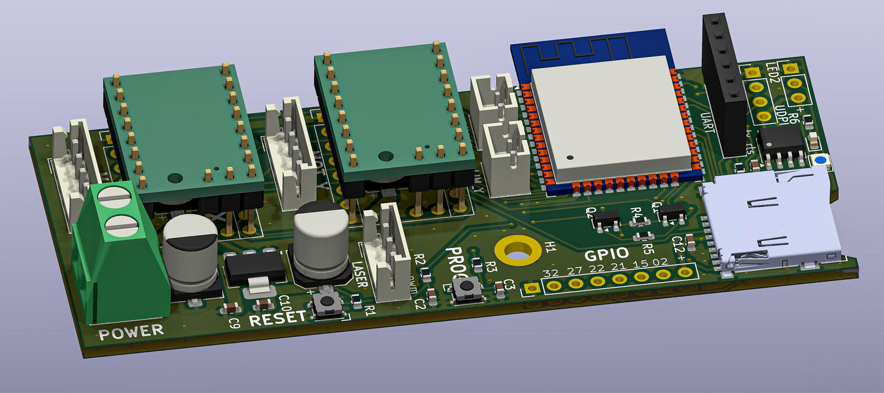

# Laser cutter electronics for Fluid NC

This is small laser cutter electronics board. The main goal of the development was to achieve a **board width of less than 4 cm** so that it could be easily mounted on standard 4020 profiles used in the construction of laser engravers. 
The board is designed for use with [Fluid NC software](http://wiki.fluidnc.com/en/home). 
## Electronics concept
The electronics are based on the **ESP32 WROOM** module, containing two **TMC2130 SPI** stepper motor drivers, a **PWM output for the laser**, and a **Micro SD card slot**. 
The initial programming of the ESP32 processor must be done via an **external USB-UART converter**; the board has a connector for this purpose. 
**!!!Make sure that the converter supplies the board with 3.3V (and not 5V)!!!** 
Further upgrades can be done using OTA. 

The board also includes an **Attiny 412 processor**, which controls a WS2812 **color status LED** (internal with the option of connecting one additional external LED). This processor can be programmed via the UPDI interface (there is a connector on the board for this purpose), which is again connected to the USB-UART converter. 
*The Attiny 412 processor with status LED is an **optional accessory**; the board works even without it.* 
## Files
The schematic and PCB layout were created in [KiCad](kicad.org) 9. The Gerber and drilling files for PCB production are stored in the "Gerber" directory. 

